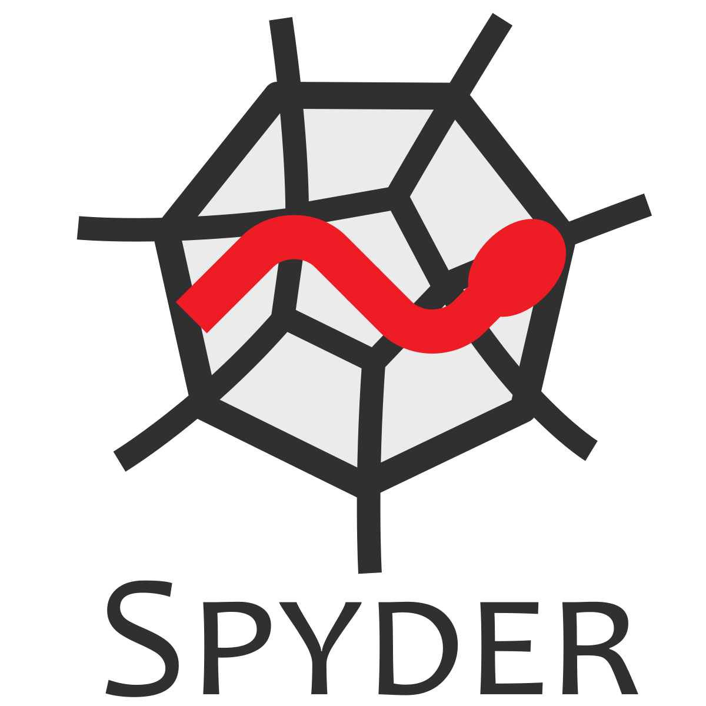

# QMB6358S22

QMB6358: Software for Business Analytics

## Course Description

This course is designed to introduce you to the main tools of business analytics. It is aimed at students interested in pursuing a career in business analytics, with an emphasis on accounting and financial data. The course begins with fundamental concepts in computing, to gain an understanding of the operations and functions that you can use to manipulate a variety of data types. You will learn how to design computer programs that obtain data by web-scraping, then read data, manipulate data, perform calculations with data and apply these to problems in business analytics. The course progresses through regression analysis, logistic regression, and other classification models, and concludes with advanced techniques, including dimension-reduction and nonparametric techniques for text analytics. 

## Learning Objectives

After completing this course, the student is expected to be able to: 
-	understand the types of data in Python and R and the corresponding operations;
-	use Python modules and R packages to solve problems;
-	write new functions in Python and R;
-	obtain, prepare and analyze data to solve a business problem; and
-	build models to explain and predict business phenomena.

## Enrollment Requirements

The formal requirement is admission to the Master of Science in Accounting program, which normally includes undergraduate coursework equivalent to UCF courses QMB 3003 and QMB 3200, Quantitative Business Tools I and II. The true requirement, however, is a quantitative mindset. Computer programming is a quantitative exercise and is suitable for those with an interest in quantitative problem solving. 

## Textbooks

*Practical Programming: An Introduction to Computer Science Using Python 3.6, 3rd Edition* by Paul Gries, Jennifer Campbell, Jason Montojo. The Pragmatic Bookshelf: Raleigh, NC, 2017 (ISBN-13: 978-1680502688, ISBN-10: 1680502689).

*Business Data Science: Combining Machine Learning and Economics to Optimize, Automate, and Accelerate Business Decisions, 1st Edition* by Matt Taddy. McGraw-Hill: New York, NY, 2019 (ISBN-13: 978-1260452778 ISBN-10: 1260452778)

*R in Action: Data Analysis and Graphics with R, 1st Edition* by Robert Kabacoff. Manning Publications Company, Shelter Island, NY, 2015 (ISBN-13: 978-1935182399, ISBN-10: 1935182390)

*Practical Programming* is the main text for the first half of the course, and we will progress through the chapters in a nearly linear fashion. Using *R in Action*, we will learn data manipulation and analysis and continue to regression modeling. The textbook *Business Data Science* will be used as a source of examples of statistical models used to solve a variety of business problems. 

## Software

The primary tool for this course is software of the following kinds. 

*A Python distribution:*  Programming in the first half of this course 
will be carried out in the 
[Python](https://www.python.org/) 
programming language. It is free, open-source software that can be downloaded from the Internet. We will use Python version 3.8. Note that Python versions 2.X will not be compatible with all of the course activities.

*R:* The [] is open-source software 
for data manipulation, statistical analysis and graphics. 
We will use R in the second half of the course. 

*Interactive Development Environments (IDE):* This is software for writing and running commands and scripts in the R and Python programming languages. 

For Python, we will use [Spyder](https://www.spyder-ide.org/), 
which is available with the
[Anaconda](https://www.anaconda.com/products/individual) 
distribution of Python. 

For R, we will use [RStudio](https://www.rstudio.com/), 
and you can 
[download RStudio here](https://www.rstudio.com/products/rstudio/download/). 

*Version control software:* We will use  
[GitHub](https://github.com/) 
repositories to share course materials. This will be the primary medium for distributing materials for course demonstrations and it offers a convenient way to obtain feedback on coding assignments. 
[GitHub Desktop](https://desktop.github.com/) 
provides a user-friendly
graphical interface for updating code repositories
and downloading updates pushed by others, including your instructor. 

